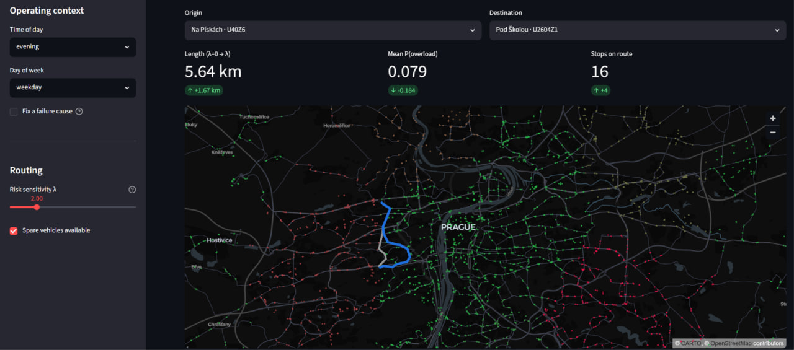

# Adaptive Public-Transport Control

Reference implementation for the dissertation *"Methods and information
technology for adaptive control of urban public transport"*
(V. Zetchenko, Chernihiv Polytechnic National University).

Repository: <https://github.com/DomCore/Adaptive-Public-Transport-Control>

The system couples three components into a single, reproducible pipeline:

1. **Bayesian Belief Network (BBN)** — predicts the probability that a stop /
   route segment is *overloaded*, given a context vector (time of day, day of
   week, failure cause). Trained on the **NY Bus Breakdown & Delays** dataset.
2. **Risk-aware A\*** — a route planner whose cost function
   `f*(n) = g(n) + h(n) + λ·R(n)` adds a probabilistic risk term
   `R(n) = −ln(1 − P(overload | xₙ))` on top of geometric distance. Demonstrated
   on the **Prague** public-transport stop network.
3. **Adaptive decision module** — maps the overload probability onto six control
   actions (`a0`–`a5`) and closes the loop with an incremental, forgetting-factor
   Bayesian update.

A separate experiment compares tabular **data-augmentation** methods
(Random Oversampling, SMOTE, ADASYN, GAN) and motivates the *CPD-aware* targeted
augmentation proposed in the thesis.

> **Cross-domain transfer.** The BBN is trained on New York school-bus data and
> applied, without retraining, to Prague city transit. Only a lightweight
> geographic localisation (K-means clustering of stops + context mapping) is
> needed. This mirrors the realistic case where a target city has no historical
> failure database of its own.

---

## Repository layout

```
adaptive-transit-control/
├── transit/                   # installable library + tool (the instrument)
│   ├── config.py              # single source of truth for paths & parameters
│   ├── bbn.py                 # BBNModel: build / load / P(overload | context)
│   ├── routing.py             # TransportGraph + risk-aware A*
│   ├── decision.py            # re-export of the decision module
│   ├── cli.py                 # `transit-control` command-line tool (Typer)
│   └── app/
│       └── dashboard.py       # interactive Streamlit dashboard
│
├── config.py                  # back-compat shim -> transit/config.py
├── run_all.py                 # orchestrator for the core pipeline (steps 00-05)
│
├── 00_fetch_prague_stops.py   # GTFS feed  -> data/prague_stops.geojson
├── 01_prepare_data.py         # NY Bus CSV -> output/data_extended.parquet
├── 02_build_bbn_pgmpy.py      # fit the BBN (uses transit.bbn) -> bbn_model.pkl
├── 03_enrich_stops.py         # cluster stops + BBN inference -> stops_enriched.json
├── 04_run_experiment.py       # risk-aware A* sweep over λ (uses transit.routing)
├── 05_generate_tables.py      # Markdown tables for the dissertation
│
├── decision/                  # adaptive decision module (a0-a5) + CPD feedback
│   └── decision_engine.py
├── augmentation/              # SMOTE / ADASYN / GAN comparison (needs TensorFlow)
│   └── compare_augmentation.py
├── tests/                     # pytest suite (decision engine, A*, package API)
├── data/                      # input data (not committed; see data/README.md)
└── output/                    # generated artefacts (git-ignored)
```

The project has three faces over one shared core (the `transit` package):

* a **Python API** — `from transit import BBNModel, TransportGraph, DecisionEngine`;
* a **command-line tool** — `transit-control` (predict / route / decide / run / serve);
* an **interactive dashboard** — `transit-control serve`.

The numbered scripts (`00`–`05`) are the low-level, reproducible pipeline; they
now import their core logic from `transit`, so there is exactly one
implementation of the BBN, the A\* and the decision rules.

### Mapping to the dissertation

| Component                         | Code                                   | Section |
|-----------------------------------|----------------------------------------|---------|
| Bayesian Belief Network           | `02_build_bbn_pgmpy.py`                | 2.1     |
| Data augmentation (SMOTE/GAN)     | `augmentation/compare_augmentation.py` | 2.2, 4.4.2 |
| Transport graph + A\*             | `04_run_experiment.py`                 | 3.1     |
| Risk term `R(n)`, modified `f*(n)`| `04_run_experiment.py`                 | 3.1.3   |
| Adaptive decision-making (a0-a5)  | `decision/decision_engine.py`          | 3.2     |
| Cross-domain transfer (NY→Prague) | `03_enrich_stops.py`                   | 4.4.5   |
| End-to-end experiment             | `run_all.py` (steps 01-05)             | 4.4.5   |

---

## Installation

Python 3.9–3.11.

```bash
git clone https://github.com/DomCore/Adaptive-Public-Transport-Control.git
cd Adaptive-Public-Transport-Control

python -m venv .venv
source .venv/bin/activate          # Windows: .venv\Scripts\activate

# Install as an editable package — this also puts `transit-control` on your PATH.
pip install -e .
```

`pip install -e .` installs the core library and the `transit-control` CLI. Two
optional extras add the heavier stacks only when you need them:

```bash
pip install -e ".[app]"    # Streamlit dashboard (transit-control serve)
pip install -e ".[dev]"    # pytest
```

The GAN augmentation experiment needs TensorFlow on top:

```bash
pip install -r augmentation/requirements-gan.txt
```

(If you prefer plain requirement files: `pip install -r requirements.txt` for the
core, plus `-r requirements-app.txt` for the dashboard and `-r requirements-dev.txt`
for the tests.)

## Data

Two openly licensed datasets are required but **not** committed (one is ~90 MB).
See [`data/README.md`](data/README.md). In short:

* `data/data.csv` — NY Bus Breakdown & Delays (NYC Open Data, `ez4e-fazm`).
* `data/prague_stops.geojson` — produced automatically by step 00 from the
  Prague PID GTFS feed.

## The `transit-control` command-line tool

Once the artefacts exist (`transit-control run`), the whole system is driveable
from one command:

```bash
transit-control info                       # what's built + a BBN summary
transit-control predict --time peak_morning --day weekday
transit-control predict --time peak_evening --cause "Heavy Traffic"
transit-control decide --p 0.78            # -> a3 + a5 (activate reserve + inform)
transit-control route --list 10            # browse well-connected stops
transit-control route --origin U237Z3 --dest U2784Z1 --lambda 2.0
transit-control run --fetch                # run the full pipeline (steps 0-5)
transit-control serve                      # launch the dashboard
```

`predict` returns `P(overload | context)` from the BBN and, by default, the
control action the decision engine would take. `route` plans a risk-aware path
on the Prague network for a given λ.

## Interactive dashboard

```bash
pip install -e ".[app]"     # one-time: Streamlit + pydeck
transit-control serve       # opens http://localhost:8501
```



The dashboard ties the whole method together on one screen:

* pick an **operating context** (time of day, day of week, optional cause);
* see the BBN's **P(overload)** and the **recommended action** (a0–a5) update live;
* read the **Bayesian network** structure with the chosen context highlighted;
* plan a route on a **map of Prague** (stops coloured green→red by overload
  probability) and compare the shortest route (λ=0) against the risk-aware route,
  with the length / risk trade-off shown as metrics.

See [`transit/app/README.md`](transit/app/README.md) for a full walkthrough of
every control and panel.

## Running the pipeline

```bash
# Fetch Prague stops, then run the whole pipeline (steps 0-5)
python run_all.py --fetch

# data/prague_stops.geojson already present -> skip the network fetch
python run_all.py

# Re-run only the A* experiment + tables (steps 4-5)
python run_all.py --from 4
```

Or run the steps individually:

```bash
python 00_fetch_prague_stops.py
python 01_prepare_data.py
python 02_build_bbn_pgmpy.py
python 03_enrich_stops.py
python 04_run_experiment.py
python 05_generate_tables.py
```

Each step writes to `output/` and prints a summary. End-to-end runtime is
roughly 5–10 minutes on a mid-range laptop (the A* sweep dominates).

### Outputs

```
output/
├── data_extended.parquet       # preprocessed dataset with BBN nodes
├── bbn_model.pkl               # fitted pgmpy model
├── stops_enriched.json         # stops + p_overload + cluster assignment
├── results_raw.csv             # every A* run (OD pair × λ)
├── results_aggregated.csv      # per-λ aggregates (dissertation Table 4.9)
├── statistical_test.csv        # paired t-test vs λ=0 (Table 4.10)
├── pareto_curve.png            # length–risk trade-off (Figure 4.4)
└── tables_for_dissertation.md  # ready-to-paste Markdown tables
```

## The decision module

The decision engine is independent of the heavy pipeline and can be used on its
own:

```python
from decision import DecisionEngine, IncrementalCPDUpdater

engine = DecisionEngine()
decision = engine.decide(p_overload=0.78, free_units_available=True)
print(decision)            # -> a3 + a5 (activate reserve + inform passengers)
print(decision.action_codes, decision.total_cost)

# Forgetting-factor feedback (CPD_new = λ·CPD_old + (1-λ)·CPD_observed)
updater = IncrementalCPDUpdater(forgetting_factor=0.90)
updater.update([0.8, 0.2], [0.4, 0.6])   # -> [0.76, 0.24]
```

| `P(overload)`        | Primary action            | Notes |
|----------------------|---------------------------|-------|
| `< 0.30`             | `a0` do nothing           | `a5` held in reserve |
| `0.30 – 0.50`        | `a5` inform passengers    | escalate to `a1` after 15 min |
| `0.50 – 0.70`        | `a1` increase frequency   | `a2` reallocate if no free units |
| `0.70 – 0.85`        | `a3` activate reserve     | `+ a5` inform passengers |
| `≥ 0.85`             | `a4` reroute via A\*       | `+ a1 + a5` |

`python decision/decision_engine.py` prints a worked example over the whole
probability range.

## Augmentation experiment

```bash
pip install -r augmentation/requirements-gan.txt
python augmentation/compare_augmentation.py
```

Writes `augmentation/output/comparison_table.md`. The headline finding: for this
well-separated tabular task (ROC-AUC > 0.95 without augmentation) no global
augmentation method — from Random Oversampling to GAN — improves the model's
discriminative power, which motivates the CPD-aware targeted approach.

## Tests

```bash
pip install -r requirements-dev.txt
pytest
```

The suite covers the decision engine (band selection, validation, CPD update),
the risk-aware A\* (distance-vs-risk trade-off) and the preprocessing helpers.
It does **not** require the input datasets.

## Reproducibility

Every stochastic step uses a fixed seed (`random_state = 42`): the K-means
clustering, the OD-pair sampling and the train/test split. Re-running the
pipeline on the same inputs reproduces the tables and figures referenced in the
dissertation.

## License

Code: [MIT](LICENSE). The input datasets keep their own licenses (NYC Open Data
terms of use; Prague PID open data, CC-BY).
